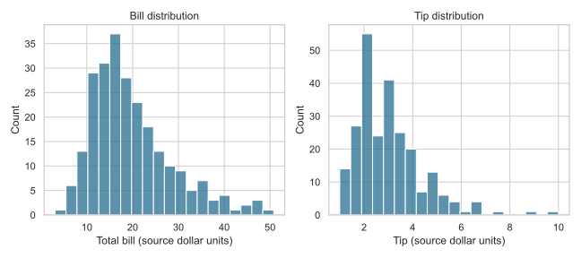
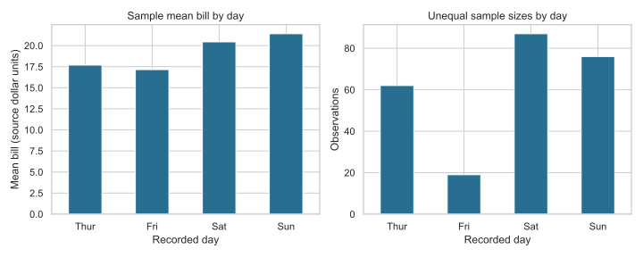

# Tips: Restaurant Bill Visualization

An exploratory analysis of 244 restaurant bill records. It shows how distributions, correlations and group averages can answer descriptive questions without overstating statistical evidence.

## Business Problem

How do recorded bills and tips vary, and how do sample averages differ by day?

## Data

The provided tips CSV has 244 records. The analysis uses total_bill, tip and day; these fields contain no missing values in the inspected file. The original assignment labels monetary fields as dollars, but the provider, collection design and redistribution terms have not been established. Raw records are excluded.

**Data source and sharing:** The immediate source is a class-provided tips CSV. Its resemblance to a public sample dataset does not establish the supplied file's provenance or license, so raw records are excluded while redistribution permission remains unverified. Recruiters can review the executed notebook, saved summaries and charts without the CSV; rerunning requires an authorized copy.

## Tools

Python, pandas, Matplotlib and Seaborn. See [tested requirements](requirements.txt).

## Methods

Histograms, Pearson correlation, day-level means and observation counts. These are descriptive analyses; no hypothesis test was performed. This focused revision omits the original demographic subgroup comparisons and their unsupported significance interpretations.

## Key Findings

- Bill and tip have a Pearson correlation of 0.6757 in this sample.
- Median bill is 17.795 and median tip is 2.90 in source dollar units.
- Sunday has the highest sample mean bill (21.41); Friday has only 19 observations versus Saturday's 87, Sunday's 76 and Thursday's 62.

## Business Value

Shows how to pair averages with sample sizes when communicating a business pattern. A real restaurant analysis would need representative shift-level data before using these patterns for staffing or revenue planning.

## Limitations

Correlation is not causation. Unequal sample sizes and an unknown sampling process limit day-to-day comparisons. Counts of these records do not establish total customer traffic; average bill is not total revenue. No statistical significance or business impact is claimed. Dataset provenance and redistribution rights remain unverified.

## Academic Context

This was an individual coursework project or exercise using a supplied dataset or template. Raw data is excluded; this portfolio includes adapted analysis, summaries and aggregate outputs only.

Applied graduate Python visualization coursework using a supplied exercise and dataset. This is not a restaurant consulting engagement.

## My Contribution

Completed as part of graduate Python visualization coursework using a supplied exercise. This portfolio version develops the distribution, bill/tip relationship and day-comparison questions from the submitted notebook. Portfolio preparation adds the missing CSV load, replaces deprecated plotting calls and removes unsupported significance interpretations.

## Selected Outputs

Bill and tip distributions in the sample; no individual records displayed.

Mean bills alongside day-level observation counts; these counts do not measure total traffic.

## Files Included

- [Executed notebook](tips-eda.ipynb)
- [Aggregate results](results.json)
- [Distribution chart](figures/bill-tip-distributions.svg) and [day-comparison chart](figures/day-comparison.svg)
- [Tested requirements](requirements.txt)

## How to Run or View the Project

View the notebook and figures on GitHub. To reproduce, obtain an authorized copy of the course tips dataset and save it as `data/tips.csv`. Install requirements.txt with pip, open a Jupyter interface from this project folder and run all cells. No raw dataset or public data license is bundled. Executed successfully with Python 3.12 on September 30, 2026.
