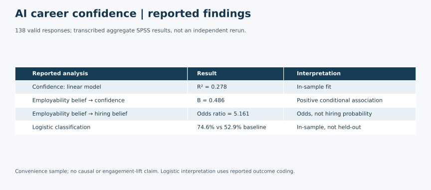

# AI Perceptions and Career Confidence Research

A marketing research and consumer insights case examining how students perceive AI-powered career tools and how those beliefs relate to career confidence. A Qualtrics survey and reported SPSS linear and logistic regression analyses of **138 valid responses** connect employability beliefs and job-replacement anxiety with self-reported confidence and hiring beliefs. The case combines research interpretation with **AI Genie**, a themed survey incentive experience, to inform questions about messaging and participant experience.

## Research Problem

How are beliefs about AI-related employability and anxiety about job replacement associated with students' confidence about securing employment? Which attitudes are associated with believing that using AI improves hiring chances?

LinkedIn and other AI-powered career services provide the strategic context: understanding how students balance perceived employability benefits with concerns about job replacement can inform messaging and research priorities. LinkedIn is an illustrative context, not a client or research sponsor.

The outcomes are self-reported attitudes, not actual job offers, employment rates or measured AI proficiency.

## Data, Privacy and Attribution Note

The report describes a cross-sectional Qualtrics survey using convenience recruitment through classes, social media and peer networks. The SPSS frequency tables show 138 valid observations, and the linear regression's total degrees of freedom of 137 are consistent with that sample size. The report's account of 139 submissions and one exclusion has not been independently reconciled to a cleaned analysis file.

Raw survey data is excluded to protect respondent privacy. This portfolio includes the research summary, methods and selected non-identifiable aggregate findings only. The available source exports contain identifying fields and are excluded. Individual portfolio use of this aggregate summary has been confirmed, with the project team's approval. The full report, poster, slide decks and questionnaire drafts are not republished. This sharing scope does not include respondent records or original team documents.

Recruiters can review this page and the [aggregate results](aggregate-findings.md) without access to respondent records. Reproduction would require authorized access to the cleaned analysis file, recoding rules and original analysis syntax. No open dataset license is asserted.

## Tools Used

- **Qualtrics:** survey platform identified in the report and export metadata.
- **IBM SPSS Statistics:** frequency tables, multiple linear regression and binary logistic regression shown in the report's output images.
- **Word and PowerPoint:** research report and presentation source materials.
- **Shopify:** creation and management of the AI Genie web experience and domain setup.

## Methods

1. Describe the sample using frequencies and percentages.
2. Fit career confidence as a function of AI job-replacement anxiety and AI employability belief using multiple linear regression.
3. Fit a binary hiring-belief outcome using career confidence, job-replacement anxiety and employability belief as predictors.
4. Interpret coefficients, reported significance tests and model summaries as associations within the observed sample.

The SPSS export metadata uses five-point agreement labels for the key attitude items. The available questionnaire drafts use seven-point scales and different demographic options, so they are not treated as the final administered instrument. The report describes recoding the binary outcome to 1 = Yes and 0 = No, while the source export uses 1 = Yes and 2 = No; the complete transformation syntax is unavailable.

The ANOVA table shown is the linear regression's overall F-test, not a separate demographic group-comparison study. The report's independent-samples t-test and k-means sections contain placeholders, so neither is claimed as a completed analysis. No held-out validation is documented.

## Key Findings

| Finding | Supported result | Interpretation |
|---|---|---|
| Career confidence model | R-squared = 0.278; adjusted R-squared = 0.267; F(2, 135) = 25.982, p < .001 | The fitted model accounts for 27.8% of the observed variation in the confidence score; this is in-sample fit. |
| Employability belief and confidence | B = 0.486, standardized beta = 0.477, p < .001 | Higher employability belief is associated with higher confidence, holding job-replacement anxiety constant. |
| Job-replacement anxiety and confidence | B = -0.145, standardized beta = -0.172, p = .021 | Higher anxiety is associated with lower confidence, holding employability belief constant. |
| Employability belief and binary hiring belief | Odds ratio = 5.161, p < .001 | A one-point increase is associated with about 5.16 times the modeled odds of the positive hiring-belief outcome, holding the other predictors constant, under the report's stated coding. This is not five times the probability of getting a job. |

The logistic classification table reports **74.6% in-sample classification**, compared with a **52.9% majority-class benchmark** calculated from the displayed outcome counts. These figures are not evidence of performance on new respondents. Additional coefficients and interpretation notes appear in [aggregate-findings.md](aggregate-findings.md).

## AI Genie: Research Activation and Incentive Experience

I created and managed AI Genie as an interactive post-survey incentive experience. After completing the survey, participants were redirected to a career-style prediction experience connected to the study's theme of AI-powered career guidance. The experience was designed to make participation more engaging and reinforce the research theme of AI, career confidence and student perceptions of AI tools.

The web experience used a career-prediction theme and a survey call to action. A campus poster promoted AI Genie and survey participation through a QR code. Together, these materials connected the research invitation with a recognizable participant experience across a website and campus recruitment.

AI Genie demonstrates how a research theme can inform incentive design and recruitment communication. Its career-style predictions are presented as an incentive concept, not validated employment forecasts. No measured increase in response rate, engagement, completion or career confidence is claimed. The screenshots document the setup and promotion; they do not independently verify the complete post-survey redirect or prediction workflow.

## Research Value

The case demonstrates how survey questions can be linked to distinct outcomes: a confidence rating and a binary belief. It also shows why scale coding, sample composition, model fit and the difference between association and causation must be checked before communicating findings.

## Business / Marketing Value and Strategic Implications

For university career services or career-tool providers, the findings suggest questions to test: does messaging about practical AI skills resonate differently from messaging that acknowledges job-replacement concerns? Interviews and controlled message tests could explore those responses before changing onboarding or campaign strategy.

This study did not measure willingness to pay, subscription conversion, campaign lift or actual hiring outcomes. It does not establish that changing a belief would improve employment prospects or that any student group is a proven high-value customer segment.

### Student segmentation: a direction for further research

Perceived employability benefits and job-replacement concerns offer possible dimensions for future student segmentation. Follow-up research could test whether students with different combinations of these attitudes respond differently to practical-skills messaging or reassurance about AI use. These are strategic hypotheses, not measured segments: no completed clustering solution, segment sizes or validated segment-specific recommendations are available. The unfinished k-means section is excluded from the reported findings.

## Limitations

- Convenience sampling and a predominantly bachelor's-level sample limit generalization beyond the respondents.
- Cross-sectional self-reports cannot establish causal effects or direction; confidence may influence beliefs as well as the reverse.
- The final administered instrument, full coding decisions and cleaned analysis file have not been reconciled. Five-point ratings are treated numerically in the reported regressions; model diagnostics and sensitivity to that choice are not established here.
- Results were checked against saved SPSS images, not independently rerun. There is no documented external or held-out validation.
- Related attitude questions may overlap conceptually. Regression significance does not establish an actionable causal mechanism.
- The supplied report is incomplete in places. Demographic hypothesis tests, k-means segments and the report's stronger causal marketing claims are not included.
- Team approval covers individual portfolio use of this non-identifiable aggregate summary; no permission to release respondent records or original team documents is implied.
- AI Genie's engagement benefit was not evaluated. Recruitment messaging or an incentive may affect who chooses to participate; that possible selection effect was not measured. The report and poster collection timelines also need reconciliation.

## Academic Context

Developed through graduate Marketing Research coursework at Texas State University, MKT 5322, as a team project. This portfolio version presents the supported research findings and my AI Genie contribution. LinkedIn was an illustrative career-services context, not a client or commissioning organization. No university endorsement is claimed.

## My Contribution

My contributions included research development, survey execution support, analysis interpretation, presentation development, and the creation and management of the AI Genie incentive experience.

This portfolio case draws on a team research study in which I, Pamela Vilchez, am credited as a coauthor. My responsibilities are described separately from the team's overall work; the original full study is not presented as solely my work. Portfolio preparation adds a focused research summary and clarifies the interpretation of the reported results.

## Portfolio Sharing Note

This case study is shared as an aggregate, portfolio-ready summary of a completed marketing research project. Raw survey data, respondent-level records, and original team documents are excluded. The project team was aware of and approved individual portfolio use of the work.

## Selected Outputs

138 valid responses; transcribed aggregate SPSS results, not an independent rerun. Convenience sample; no causal or engagement-lift claim. Logistic interpretation uses reported outcome coding.

This visual summarizes previously reviewed aggregate results; it does not represent a new analysis run.

## Files Included

- [Aggregate summary visual](visuals/ai-research-findings.svg)

- [Research summary](README.md): questions, context, methods, findings and limitations.
- [Aggregate findings](aggregate-findings.md): selected transcribed model results, sample checks and interpretation notes.

The portfolio includes summaries and aggregate findings only. Recruitment photos, website screenshots, administrative screens and original team materials are excluded. The reported SPSS models were not independently rerun.
