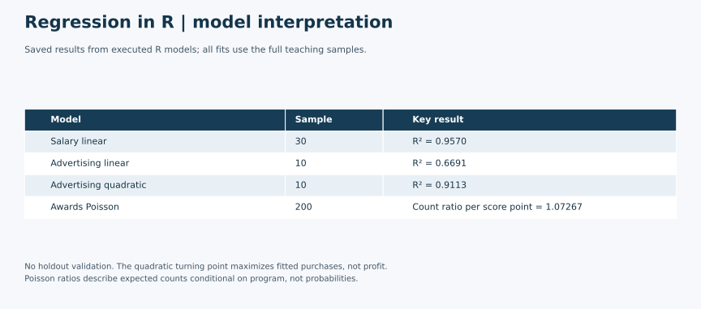

# Regression Modeling in R

A regression case study comparing linear, quadratic polynomial and Poisson models for different outcome types. The marketing example compares advertising models: the quadratic fit has an in-sample R-squared of **0.9113**, compared with **0.6691** for the straight-line model. A standalone R script reproduces the model specifications and exports aggregate results without distributing the datasets.

## Business Problem

How should model choice and interpretation change when an outcome is a continuous value, a curved response to advertising, or a nonnegative count?

The primary marketing question is how online advertising spending relates to customer purchases. Salary and student-award examples provide supporting practice with continuous and count outcomes; they are not presented as separate marketing campaigns.

## Data / Model Setup

| Teaching dataset | Analyzed rows | Outcome | Predictors |
|---|---:|---|---|
| Linear | 30 | Salary | Experience |
| Advertising | 10 | Purchases | Online spending; spending squared in the quadratic model |
| Poisson | 200 | Number of awards | Program and math score |

The coursework describes the count example as awards earned by students at one high school. The original providers, collection designs and redistribution permissions have not been independently established. Raw datasets, saved R workspaces, command history and original assignment documents are excluded.

Raw data is excluded while redistribution permission remains unconfirmed. Reviewers can evaluate the script, aggregate coefficients and model comparisons without the source records. Only aggregate model outputs are included. Monetary values retain the source scale; the precise currency and spending period are unverified. Authorized source files are required to rerun the analysis. Familiar dataset values or filenames are not treated as evidence of an open license.

## Tools Used

**R**, using `stats::lm()` and `stats::glm()` with a Poisson log link. The standalone portfolio script uses base R CSV import and requires no additional packages. It was successfully executed with **R 4.5.2** during portfolio preparation.

## Methods

- Fit `Salary ~ Experience` by ordinary least squares.
- Compare `purchases ~ online` with `purchases ~ online + online_2`, where `online_2 = online^2`, using the same ten rows.
- Calculate the quadratic turning point as `-b / (2a)` and verify that the curve is concave and the point lies within the observed spending range.
- Fit `awards ~ program + score` using Poisson regression, with Academic as the program reference category.
- Interpret exponentiated Poisson slopes as ratios of expected counts, holding the other predictor fixed.

The original script contains an advertising scatterplot command. A rendered original plot was not recovered, and this summary does not present a newly produced figure as original coursework. The saved model objects and fresh fits provide fitted values, but respondent-level fitted values are not exported.

Model comparison uses in-sample R-squared, adjusted R-squared and AIC. AIC is compared only between the two advertising models fitted to the same outcome and observations. There is no train/test split or cross-validation in this project.

## Key Findings

| Model | Verified result | Meaning |
|---|---|---|
| Salary linear model | Intercept 25,792.20; experience coefficient 9,449.96; R-squared 0.9570 | One additional experience unit is associated with about 9,450 salary units within this sample. |
| Advertising linear model | R-squared 0.6691; adjusted R-squared 0.6277; AIC 108.36 | Straight-line benchmark on ten observations. |
| Advertising quadratic model | R-squared 0.9113; adjusted R-squared 0.8859; AIC 97.20 | Better in-sample fit than the straight-line specification, not established superiority on new data. |
| Poisson math-score slope | Coefficient 0.07015; exp(coefficient) 1.07267 | About 7.27% higher expected award count per score point, conditional on program. |
| Poisson program comparison | General/Academic ratio 0.33829; Vocational/Academic ratio 0.48966 | Lower modeled expected counts than Academic at the same score, not causal program effects. |

The quadratic equation is approximately:

`purchases = −76.8498 + 0.4689175 × online − 0.0001402805 × online²`

Its fitted maximum occurs near **1,671.36 spending units**, within the supplied 500–2,200 range. This maximizes predicted purchases under the quadratic equation. It does **not** maximize profit, since purchase value, contribution margin and the cost objective are not specified.

## Model Interpretation

The negative squared-spending coefficient means the modeled marginal association changes with spending: `0.4689175 − 0.000280561 × online`. The linear coefficient alone is not a constant spending effect in the quadratic model.

For Poisson regression, coefficients apply to the log expected count. Exponentiating a slope converts it to an expected-count multiplier; it is not a probability or odds ratio. The intercept's exponential value is a baseline expected count at score zero, not a program comparison.

Statistical significance does not establish causation. A higher in-sample R-squared does not establish forecast accuracy. The source write-up's salary intercept of 2,579 is a transcription error; the saved model and fresh fit both support 25,792.20.

## Business Value

The case shows how to choose a model form that fits the outcome and communicate what its coefficients mean. For advertising planning, it motivates checking for curvature rather than assuming a constant return at every spending level. The turning point is a hypothesis for further validation, not a ready-to-implement budget recommendation.

## Limitations

- The advertising comparison uses only ten observations. Model stability and performance on future campaigns are untested.
- All fits use their full teaching samples. Reported fit statistics are not held-out performance measures.
- No causal design, verified sampling frame or external validation is supplied.
- Poisson regression assumes a suitable conditional mean/variance structure and independent observations. A portfolio Pearson dispersion calculation of approximately 1.08 is only a diagnostic, not proof that those assumptions hold.
- The source imports were absent from the script and depended on objects already in the R session. The portfolio version repairs that dependency; it does not claim the original script ran standalone.
- Dataset provenance, required course credit and any collaborator attribution remain subject to confirmation before public release.

## Academic Context

This was an individual coursework project or exercise using a supplied dataset or template. Raw data is excluded; this portfolio includes adapted analysis, summaries and aggregate outputs only.

Completed or adapted from graduate Marketing Analytics coursework, Week 6 regression exercises. The supplied materials include class scripts and three teaching datasets. This is an academic modeling case, not client work or a deployed forecasting system.

The named homework script includes all three model types, and the saved R workspace contains the corresponding fitted objects. Its logistic section contains only data attachment and name inspection, so **logistic regression is excluded as incomplete**.

## My Contribution

My named submission combines regression code with a written interpretation of the salary, advertising and award-count examples. The homework script matches a copy in the assignment folder; the underlying exercises and datasets are credited as supplied coursework rather than claimed as original data collection or methods.

Portfolio preparation makes data loading explicit, replaces `attach()` with scoped data references, fixes the Poisson reference category, and exports aggregate coefficients and model summaries. It also corrects the salary-intercept transcription and distinguishes a fitted purchase maximum from a profit-optimal advertising budget. The fitted model specifications are retained.

## Selected Outputs

Saved results from executed R models; all fits use the full teaching samples. No holdout validation. The quadratic turning point maximizes fitted purchases, not profit. Poisson ratios describe expected counts conditional on program, not probabilities.

This visual summarizes previously reviewed aggregate results; it does not represent a new analysis run.

## Files Included

- [Aggregate summary visual](visuals/r-regression-model-summary.svg)

- [Standalone R script](regression-models.R)
- [Aggregate model comparison](model-comparison.csv)
- [Coefficients and significance tests](coefficients.csv)
- [Turning-point and dispersion checks](model-checks.csv)

For reproduction, obtain authorized copies of the three coursework spreadsheets and export their populated data tables as `linear.csv`, `poly.csv` and `poisson.csv` in a local `data/` directory. Preserve the column names shown above: `Experience, Salary`; `online, purchases`; and `awards, program, score`. Program labels must be `Academic`, `General` and `Vocational`.

Run `Rscript --vanilla regression-models.R data .` from this project folder. The script writes the three aggregate CSV files and never changes the inputs. During portfolio preparation, source workbook values were converted privately to CSV and the script was executed in a clean R session. Fresh coefficients were compared with the saved coursework model objects; the outputs here are from the portfolio run, not original saved console screenshots.
