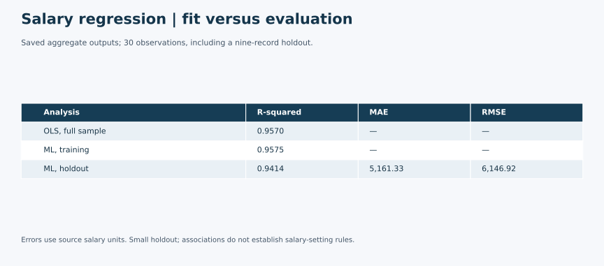

# Salary and experience: regression analysis

A regression case study examining the association between years of experience and salary, using ordinary least squares and a train/test linear regression workflow. It demonstrates model interpretation and the distinction between in-sample fit and held-out evaluation.

## Business Problem

How does salary relate to years of experience in a small teaching dataset, and how does fitted performance compare with held-out evaluation?

## Data

Thirty observations with YearsExperience and Salary. Source, currency, and redistribution terms remain to be confirmed; raw records are not included.

**Data source and sharing:** The immediate source is the class-provided Salary_Data.csv teaching file. Its original provider and public/sample-data license are unverified, so raw records are excluded pending redistribution permission. Recruiters can review both executed notebooks, model summaries and saved evaluation outputs without the CSV; rerunning requires an authorized copy.

## Tools

Python, pandas, statsmodels, and scikit-learn. NumPy was used separately to cross-check saved results.

## Methods

OLS with an intercept, plus a linear regression fit to a 70% training sample and evaluated on a 30% holdout. The portfolio ML notebook uses random_state=42 and was executed successfully on September 30, 2026.

## Business Value

Demonstrates regression interpretation and the importance of separating fitted performance from evaluation on unseen observations. It is not sufficient evidence for operational salary decisions.

## Key Findings

The local teaching dataset has 30 observations. An independent NumPy least-squares calculation reproduced an OLS slope of 9,449.96 salary units per year, an intercept of 25,792.20, and R-squared of 0.9570. These describe association, not a causal return to experience. Currency and dataset provenance require confirmation.

The submitted ML notebook stored training R-squared of 0.9731 and test R-squared of 0.9056. Its displayed test-row indices let us independently reconstruct the test R-squared. This is a numerical cross-check, not execution of the original notebook. The original split had no random seed.

## Academic Context

This was an individual coursework project or exercise using a supplied dataset or template. Raw data is excluded; this portfolio includes adapted analysis, summaries and aggregate outputs only.

Graduate Python coursework using a supplied class template and dataset; not an employment compensation study or client engagement.

## My Contribution

Completed as part of graduate Python coursework using a supplied class template. This portfolio version brings together OLS interpretation and train/test regression, with a fixed random seed, relative data paths and added error metrics. The original assignment results and the revised portfolio results are identified separately; the use of a class template is retained as academic context.

## Selected Outputs

Saved aggregate outputs; 30 observations, including a nine-record holdout. Errors use source salary units. Small holdout; associations do not establish salary-setting rules.

This visual summarizes previously reviewed aggregate results; it does not represent a new analysis run.

## Files Included

- [Aggregate summary visual](visuals/salary-regression-results.svg)

- [OLS notebook](salary-regression-ols.ipynb)
- [ML notebook](salary-regression-ml.ipynb)
- [Analysis changes](CHANGELOG.md)
- [Tested dependencies](requirements.txt)

Both revised notebooks were executed successfully. For the fixed-seed ML split, training R² is 0.9575, test R² is 0.9414, MAE is 5,161.33 and RMSE is 6,146.92 salary units. These replace neither the original stored results nor their historical split; they evaluate the revised reproducible version. Individual data rows are not published in outputs.

## How to Run or View the Project

Read the executed notebooks on GitHub. For a local run, use Python 3.12 with the tested versions in [requirements.txt](requirements.txt) and a Jupyter notebook interface. From this project directory, place the authorized original Salary_Data.csv at data/Salary_Data.csv and run each notebook from top to bottom. Expected fields: YearsExperience and Salary. Data is intentionally excluded pending source and redistribution review. No dataset license is asserted.

## Limitations

Thirty teaching observations and a nine-row test sample provide limited evidence of generalization. Occupation, education, geography, and other factors are not modeled. Do not use this exercise as a salary-setting tool. The assignment uses a supplied class template; no original dataset collection or professional compensation study is claimed.
