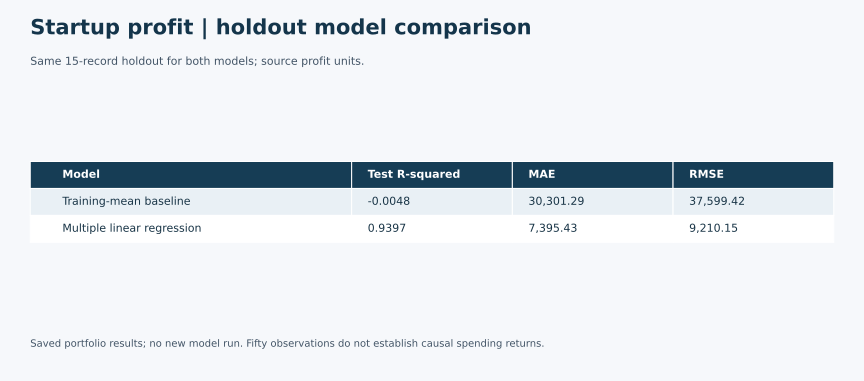

# Startup Profit Regression

A predictive modeling case study relating R&D, administration and marketing spending, plus state, to profit in a 50-record sample. The revised fixed holdout achieves test R² **0.9397**; the small sample limits what this result can establish.

## Business Problem

Can recorded company spending and state indicators predict profit within this sample?

## Data

`50_Startups.csv` has 50 rows with R&D Spend, Administration, Marketing Spend, State and Profit. No missing values or exact duplicates were found. Dataset provider, collection method, currency and redistribution terms remain unverified. Raw records are excluded.

**Data source and sharing:** The immediate source is a class-provided 50_Startups.csv teaching file. A familiar filename does not establish its original provider or redistribution rights, so raw records are excluded. Recruiters can review the executed notebook, OLS comparisons and aggregate evaluation results without the CSV; rerunning requires an authorized course copy.

## Tools

Python, pandas, NumPy, scikit-learn and statsmodels. See [tested dependencies](requirements.txt).

## Methods

The revised notebook uses a fixed 70/30 split with random_state=42, one-hot state encoding fit inside the training pipeline, and ordinary multiple linear regression. A training-mean baseline provides context. The original submission tried unseeded 70/30 and 90/10 splits; those were replaced with one specification, so results below belong to this portfolio revision. MAE, MSE and RMSE are added alongside R².

## Key Findings

On 15 held-out observations, linear regression achieved R² 0.9397, MAE 7,395.43, MSE 84,826,955.03 and RMSE 9,210.15. The mean baseline achieved R² −0.0048 and RMSE 37,599.42. Training R² was 0.9511. Errors are in source profit units, with MSE in squared units.

### OLS specification comparison

The additional named OLS coursework notebook compares a full model with versions excluding marketing or R&D spending. The existing portfolio notebook now reproduces those three formulas in a separate section. This is an in-sample explanation, not another holdout evaluation or a model-selection step. Full-model R² is approximately 0.951, versus 0.948 without marketing and 0.613 without R&D. The original source's “accuracy” wording is corrected: R² describes explained sample variation, not the percentage of predictions that are correct. Predictor correlation and specification changes do not establish causal spending returns.

## Business Value

Demonstrates how a multiple-regression model can be compared with a simple benchmark. A practical follow-up would verify the sample and test on independent observations before using forecasts in planning. The analysis cannot establish the profit caused by reallocating a marketing budget.

## Limitations

Fifty teaching observations and a 15-row holdout are too limited for broad claims. There is no temporal validation, causal design or verified sampling frame. Dataset provenance and redistribution rights remain unverified.

## Academic Context

This was an individual coursework project or exercise using a supplied dataset or template. Raw data is excluded; this portfolio includes adapted analysis, summaries and aggregate outputs only.

Applied graduate Python coursework based on a supplied multiple-regression template. This is not client work, investment advice or a causal budgeting study.

## My Contribution

Completed as part of graduate Python coursework using a supplied multiple-regression template. This portfolio version consolidates the submitted regression analyses into a reproducible workflow, adds a baseline and error metrics, and separates the coursework OLS specification comparisons from held-out evaluation. Results from the revised fixed split are identified as portfolio results.

## Selected Outputs

Same 15-record holdout for both models; source profit units. Saved portfolio results; no new model run. Fifty observations do not establish causal spending returns.

This visual summarizes previously reviewed aggregate results; it does not represent a new analysis run.

## Files Included

- [Aggregate summary visual](visuals/startup-model-comparison.svg)

- [Executed notebook](startup-profit-regression.ipynb)
- [Aggregate evaluation results](results.json)
- [Tested requirements](requirements.txt)

## How to Run or View the Project

View the saved notebook on GitHub. For reproduction, obtain an authorized original course dataset and place it at `data/50_Startups.csv`. Install requirements.txt with pip and run every cell from this project folder in a Jupyter interface. Raw data is not bundled and no public acquisition license is asserted. Executed successfully with Python 3.12 on September 30, 2026.
