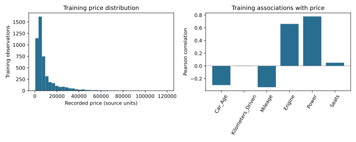
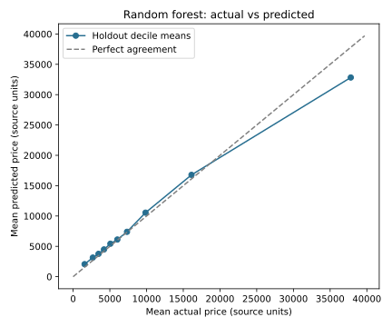

# Used Cars Price Prediction

A pricing analysis that evaluates how vehicle characteristics predict recorded used-car prices. The completed notebook combines data preparation, training-only exploration and regression evaluation. On a 1,204-row holdout, a random forest achieved R² **0.833** and MAE **1,783.55 source price units**. These are sample evaluation results, not current market valuations.

## Business Problem

Can vehicle characteristics help estimate recorded used-car prices and identify where pricing estimates are less reliable?

## Data

The supplied `Used Cars-1.csv` contains 6,019 rows and ten fields: Year, Kilometers_Driven, Fuel_Type, Transmission, Owner_Type, Mileage, Engine, Power, Seats and Price. Two exact duplicate rows are removed, leaving 6,017. The source provider, collection period, price currency and redistribution rights are not established; raw data is not included. A fixed 2019 reference is used to calculate Car_Age, not to assert the data collection year.

**Data source and sharing:** The immediate source is a class-provided CSV, not a verified public-data release. Raw records are excluded because the original provider and redistribution permission have not been established. Recruiters can review the executed notebook, aggregate model metrics and charts without downloading the dataset; rerunning requires an authorized course copy.

## Tools

Python, pandas, NumPy, Matplotlib and scikit-learn. Executed with Python 3.12; tested package versions are in [requirements.txt](requirements.txt).

## Methods

- Numeric conversion and missing-value checks; nonpositive Mileage and Seats values treated as missing.
- Car_Age = 2019 − Year; omit Year to avoid duplicating the same feature.
- Fixed 80/20 split (`random_state=42`): 4,813 training and 1,204 test rows.
- Training-only median imputation, categorical imputation and one-hot encoding of fuel type, transmission and owner type.
- Training-mean baseline, linear regression and a 200-tree random forest with minimum leaf size 3. Specifications were fixed before test evaluation, with no tuning against the holdout.
- Test R², MAE, MSE and RMSE, plus an actual-versus-predicted comparison aggregated by price decile.

## Key Findings

| Model | Test R² | MAE | MSE | RMSE |
|---|---:|---:|---:|---:|
| Training-mean baseline | −0.0001 | 7,230.03 | 140,551,750.24 | 11,855.45 |
| Linear regression | 0.6495 | 3,847.33 | 49,256,879.22 | 7,018.32 |
| Random forest | 0.8329 | 1,783.55 | 23,476,806.85 | 4,845.29 |

MAE and RMSE use source price units; MSE uses squared units. R² is not a percentage of predictions that are correct.

In training data, Power has a 0.779 correlation with Price and Car_Age has a −0.302 correlation. These associations are not causal. For the highest actual-price decile in the holdout, mean actual price is 37,810.75 versus a random-forest mean prediction of 32,831.21, showing underestimation at the expensive end.

## Business Value

The exercise shows how pricing estimates can be evaluated against a simple benchmark and how aggregate accuracy can hide expensive-vehicle errors. It supports a review workflow, not automated price setting. Recommendations are to verify currency and provenance, obtain vehicle condition and make/model details, and validate on recent market data before operational use. No revenue improvement is claimed.

## Limitations

One random holdout provides limited generalization evidence. There is no temporal or external validation, and vehicle IDs are unavailable to rule out repeated vehicles. Removing exact duplicates assumes redundant records. The linear model produces 128 negative test predictions and should not be used as a pricing rule. The forest still underestimates the highest-price group. Missing specifications and extreme kilometer values remain important quality concerns. Dataset provenance and units remain unverified. Rerunning requires authorized data access; no right to redistribute the excluded source files is asserted.

## Context and Data Note

This analysis began in graduate group coursework on the supplied Cars4U pricing case. The portfolio is an independent adaptation prepared by Pamela Vilchez to demonstrate the full analysis workflow. It includes adapted code, aggregate outputs, metrics, charts and documentation only; raw data and original team/source files are excluded. The original full coursework submission is not claimed as solely my work. Cars4U is a classroom case, not a client or employer.

## My Contribution

Prepared as an independent portfolio version of graduate group coursework. The original coursework covered cleaning, exploratory analysis and feature selection. The **Portfolio Extension: Regression Modeling** completes the modeling workflow with preprocessing pipelines, a fixed holdout, a baseline, two regression models and error analysis. The extension uses a fixed 2019 age reference and training-only imputation; the additional group cleaning notebook used 2026 and whole-dataset medians. These are portfolio methodology changes, not results from the original group submission.

## Selected Outputs

Training-only price distribution and feature correlations; associations are not causal.

Random forest holdout decile means; aggregation can hide individual prediction errors.

## Files Included

- [Executed notebook](used-cars-price-prediction.ipynb)
- [Evaluation table](model-metrics.csv) and [aggregate results](results.json)
- [Training chart](figures/training-exploration.svg) and [comparison chart](figures/actual-vs-predicted.svg)
- [Tested dependencies](requirements.txt)

## How to Run or View the Project

Read the notebook and figures directly on GitHub. To reproduce, obtain an authorized copy of the original course dataset from your course materials; it is not bundled and no public download license is asserted. Place it at `data/Used Cars-1.csv` inside this project folder. Install `python -m pip install -r requirements.txt`, launch `jupyter lab` from this folder, and run the notebook top to bottom. JupyterLab is a viewing option and can be installed separately; notebook execution was tested with nbclient and ipykernel. The run writes only aggregate results and charts, never the input dataset.

This notebook was executed successfully on September 30, 2026. Its saved results come from the new portfolio workflow, not the original Colab notebook.
