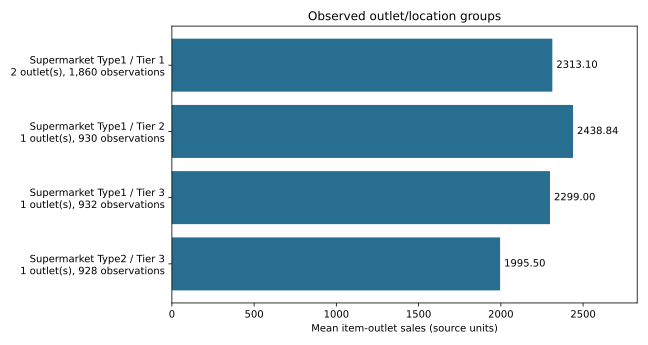
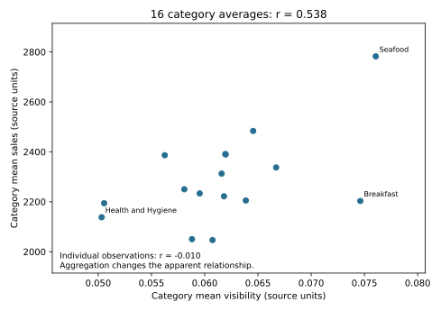

# BigMart Retail Sales Analysis

A retail analytics case examining product visibility and sales through descriptive comparisons and aggregate checks. Rechecking the clean data shows why the level of aggregation matters: visibility and sales correlate at **0.538 across category averages**, but **−0.010 across individual records**. These observations motivate testing, not a proven sales-growth strategy.

## Business Problem

How do product and outlet characteristics relate to recorded sales, and what evidence would be needed before changing shelf visibility?

## Data

The clean workbook contains **4,650 product-outlet observations**, **14 fields** and **five unique outlets**. It retains 12 original fields and adds standardized fat-content labels and Outlet_Age. The target is Item_Outlet_Sales; the main exploratory variable is Item_Visibility.

No blank cells were found in the loaded data, but 292 observations have zero visibility, which may represent true zero or unrecorded visibility. Outlet_Age uses the coursework convention `2026 − Outlet_Establishment_Year`, not an established sales observation date.

**Data source and sharing:** the immediate source is a class-provided BigMart workbook, cleaned for the assignment. It is not a verified public-data release. Raw workbooks are excluded because the original provider and redistribution rights remain unverified. The sales currency, observation period and sampling method also remain unconfirmed. Recruiters can review the written analysis, aggregate statistics, derived figures and Python scripts without the workbook. An authorized copy of the course workbook is required for reproduction.

## Tools

Excel for cleaning and summary statistics; Tableau for original visualizations and clustering. Python, pandas, openpyxl and Matplotlib are used for the reproducible portfolio checks and figures.

## Methods

- Standardize LF/low fat to Low Fat and reg to Regular; add Outlet_Age.
- Summarize sales distributions, product categories and outlet/location combinations.
- Compare mean sales and visibility across categories, keeping aggregation explicit.
- Review the final report's two-cluster Tableau exploration separately from independently reproduced calculations.
- Recalculate correlations at both record and category levels, and count unique outlets behind group means.

## Key Findings

Mean sales are 2,272.04 versus a median of 1,939.81 source units. Values range from 69.24 to 10,256.65.

| Observed group | Records | Unique outlets | Mean sales |
|---|---:|---:|---:|
| Supermarket Type 1 / Tier 1 | 1,860 | 2 | 2,313.10 |
| Supermarket Type 1 / Tier 2 | 930 | 1 | 2,438.84 |
| Supermarket Type 1 / Tier 3 | 932 | 1 | 2,299.00 |
| Supermarket Type 2 / Tier 3 | 928 | 1 | 1,995.50 |

Type 1 / Tier 2 has the highest observed mean, but it represents only one outlet. Type 2 is absent from Tiers 1 and 2, so these data cannot support a comparison between outlet types within every tier.

Across 16 item-category means, visibility/sales correlation is 0.5379; across 4,650 individual observations, it is −0.0096. The first calculation gives each category one point, regardless of its record count; the second uses each product-outlet record. A positive pattern in category averages does not establish a comparable relationship for individual items. The near-zero record-level correlation also does not rule out nonlinear relationships or effects obscured by other variables.

### What the final report adds

The report includes 19 chart images covering distributions, category comparisons, outlet/location comparisons and two clusters. It reports within-cluster trend-line p-values of approximately 0.027 and 0.87. Those p-values and exact cluster assignments have **not been independently reproduced** from the workbook; they are reported coursework results, not validated performance metrics. The report describes two selected clusters using average visibility and average sales, but it does not establish the full clustering configuration. The available Tableau workbook contains 11 descriptive worksheets, including Figure 11 with AVG visibility, AVG sales and a linear trend line; it contains no cluster definitions or saved p-values. It therefore cannot verify the final report's clustering or its p-values. The clean data workbook also has no cluster-assignment field. The figures support the existence of the exploration, not a causal effect of visibility. Because the report describes using sales to form the clusters, subsequent significance tests involving sales require caution about selection effects; the reported p-values are not confirmatory evidence of a merchandising effect.

## Business Value and Recommendations

The analysis provides a starting point for a merchandising experiment. Verify what visibility measures and resolve zero values first. Then compare a defined placement change against an unchanged comparison group, preferably with randomized assignment and a prespecified outcome. Account for price, promotions, product mix, repeated observations and seasonality. The report's proposed pilot is a recommendation, not an intervention that was performed; a simple before/after change would not isolate the effect of placement.

No measured revenue lift, validated rollout return or customer response is claimed. The supplied sample cannot establish that one location tier is generally superior.

## Limitations

Only five outlets are represented, with outlet type and location partly confounded. Record-level and aggregate associations differ. Cluster variables, scaling, assignments, cluster-specific trend-line settings and stability require the final Tableau workbook or its model summaries for verification; the available descriptive workbook does not contain them. Non-significance is not proof of no effect; significance is not proof of causality. No held-out forecast, experimental lift or out-of-sample cluster validation is supplied. Dataset provenance, observation period and units remain unverified. No redistribution right is asserted for the excluded workbooks or source documents.

## Context and Data Note

Prepared by Pamela Vilchez as an independent portfolio adaptation of Spring 2026 graduate Marketing Analytics group coursework using a supplied BigMart dataset. This version demonstrates retail analytics, aggregation, visualization and interpretation through aggregate findings, verified comparisons, recreated charts, scripts/checks and documentation. Raw data, original workbooks, reports and team/source files are excluded. BigMart is a classroom case, not a client or employer. The final report, dated May 6, 2026, extends the earlier descriptive draft with multivariate charts, two Tableau clusters and proposed merchandising pilots. Clustering is exploratory segmentation, not a validated sales-prediction model.

## My Contribution

I completed data preparation, problem framing, descriptive analysis, visualizations and written analysis as part of graduate coursework. The academic report was submitted in a group context; this summary does not claim sole authorship of the full team submission. This portfolio version adds Python aggregate checks and recreated charts, clearly separated from the original Excel and Tableau analysis.

## Selected Outputs

Observed mean sales and outlet counts; the leading group represents just one outlet.

Category-average versus record-level correlations; no causal visibility effect or verified cluster result.

## Files Included

- [Aggregate analysis script](analyze_sales.py) and [recalculated findings](sales-findings.json)
- [Sales chart](figures/sales-by-outlet-group.svg) and [aggregation comparison](figures/visibility-category-comparison.svg)
- [Original/clean workbook verification utility](verify_data.py) and [verification results](verification-results.json)
- [Tested dependencies](requirements.txt)

The original report and raw workbooks are not republished. Charts here are Python recreations from the clean data, not screenshots claimed as newly executed Tableau views.

## How to Run or View the Project

Read this page and the figures on GitHub. With Python 3.12 and an authorized clean workbook, install `python -m pip install -r requirements.txt`, then run `python analyze_sales.py CLEANED.xlsx --output-dir .` from this folder. It reads the Data sheet and writes aggregate JSON and SVG figures without modifying the input.

To compare original and cleaned files, run `python verify_data.py ORIGINAL.xlsx CLEANED.xlsx`. These scripts read saved values; they do not recalculate Excel formulas or recreate the Tableau clusters. The aggregate analysis was executed successfully against the clean workbook export on September 30, 2026.
