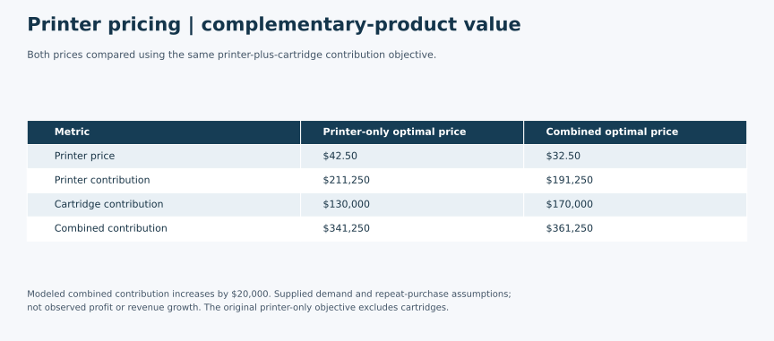

# Printer and Cartridge Price Optimization

An Excel pricing case showing how complementary-product margins can change the best price for the main product. Under the specified demand and cost assumptions, the printer-only optimum is **$42.50**. Including cartridge contribution lowers the modeled optimum to **$32.50**. These are conditional model recommendations, not observed market results.

## Business Problem

What printer price maximizes contribution when considering printer sales alone, and how does that price change when each printer generates cartridge purchases?

## Data / Model Setup

Let `p` be printer price and `Q` be modeled printer demand:

`Q = 15,000 − 200p`

| Coursework input | Value |
|---|---:|
| Printer unit cost | $10 |
| Cartridge selling price | $10 |
| Cartridge unit cost | $5 |
| Cartridges per printer per year | 4 |
| Cartridge contribution per printer | 4 × ($10 − $5) = $20 |

The source has 40 price rows, each with demand calculated from the supplied equation. They are not 40 independent observations of market demand. The workbook labels volume and cartridge usage on an annual basis; the model applies that convention without summing the price rows into a yearly sales total. Dollar notation follows the assignment, without asserting a specific currency jurisdiction.

Original workbooks and class materials are excluded because redistribution permission is unconfirmed. This repository contains summarized formulas and results, with no manager names, raw source table, instructor slides or original workbook metadata. The [calculation summary](model-calculations.md) lets readers follow the model without those files.

## Tools Used

**Microsoft Excel:** formulas, a demand chart with linear trend lines, and a saved Solver setup. The submission also explicitly refers to using Solver. The combined-case setup identifies the printer-price cell as the decision variable and total contribution as the objective. No Solver Answer Report or convergence log was found, and Excel Solver was not rerun for this portfolio review.

## Methods

1. Plot the supplied price-demand relationship.
2. Calculate printer contribution as `Q × (p − 10)`.
3. Calculate cartridge volume as `4Q` and cartridge contribution as `4Q × (10 − 5)`.
4. Compare the saved optimized prices for printer-only and combined contribution.
5. Verify the workbook's arithmetic and independently solve the two quadratic objectives. The analytical checks are portfolio verification additions, not new evidence of a historical Solver run.

The workbook calls these outputs profit. They are described here as **contribution before unmodeled fixed costs and other expenses**, because the formulas subtract only the stated unit costs.

## Key Findings

| Metric | Printer-only optimum | Printer-plus-cartridge optimum |
|---|---:|---:|
| Printer price | $42.50 | $32.50 |
| Modeled printer units | 6,500 | 8,500 |
| Printer contribution | $211,250 | $191,250 |
| Cartridge units under the four-per-printer assumption | 26,000* | 34,000 |
| Cartridge contribution | $130,000* | $170,000 |
| Combined contribution at that price | $341,250* | $361,250 |

*The cartridge and combined values at $42.50 are additional comparison calculations using the same assumptions. They are not displayed in the original printer-only results block, whose objective excludes cartridges.*

Reducing price from $42.50 to $32.50 increases modeled printer volume by 2,000 units. Printer contribution falls by $20,000, but cartridge contribution rises by $40,000, giving a **$20,000 increase in combined contribution**. Comparing $211,250 directly with $361,250 would mix different objectives and overstate the benefit of changing the price.

At $32.50, modeled cartridge revenue is $340,000 and cartridge contribution is $170,000. Revenue is derived as quantity times price; it is not the same as profit.

## Pricing Recommendation

Under the supplied linear demand equation, constant unit costs and four cartridge purchases per printer, use **$32.50** when maximizing combined contribution. If the objective excludes cartridge purchases, the corresponding model optimum is **$42.50**.

Before applying either price commercially, validate demand at those prices, cartridge attachment and repeat purchasing, competitive responses, capacity, service costs and the timing of cartridge purchases. Both prices are below the $46–$68.50 range in the supplied table, so the recommendation depends on extending the classroom demand equation beyond that range.

## Business Value

The case illustrates why maximizing a single product's margin can miss the value of complementary purchases. It provides a clear framework for comparing contribution across products while keeping the demand and repeat-purchase assumptions visible. No realized revenue increase, customer response or implementation is claimed.

## Limitations

- Demand is specified by a deterministic formula, not estimated from independent customer or transaction data.
- Four cartridges per printer is assumed for every modeled sale, with no churn, competing cartridges or discounting of later purchases.
- Cartridge price is fixed at $10; this is not joint optimization of both prices.
- Fixed costs, taxes, capacity, competitor responses and stock constraints are absent from the displayed objective formulas.
- Annual demand and repeat purchases are combined using the assignment's convention; acquisition timing is not modeled.
- Several costs and the cartridge multiplier are repeated as constants in the source calculations rather than linked to one input cell. Source inputs should not be changed without checking those formulas.
- Saved Solver settings and results are available, but no solver execution log or native rerun is supplied. The portfolio verifies the mathematical objectives independently.
- Coursework-source attribution and the terms for sharing this adapted case summary remain to be confirmed; original assignments and raw workbooks are excluded.

## Academic Context

This was an individual coursework project or exercise using a supplied dataset or template. Raw data is excluded; this portfolio includes adapted analysis, summaries and aggregate outputs only.

Completed or adapted from graduate Marketing Analytics coursework, Week 3: Price Optimization. The assignment uses a supplied demand relationship and cost assumptions. It is an educational model, not a client engagement or a pricing recommendation for a real printer manufacturer.

## My Contribution

My named assignment submission contains a demand chart, printer-only and combined-product calculations, saved Solver settings and a written explanation of the pricing trade-off. The underlying demand table and model assumptions were supplied in the coursework. This portfolio version summarizes that analysis and adds an independent arithmetic and analytical check of the saved results.

## Selected Outputs

Both prices compared using the same printer-plus-cartridge contribution objective. Modeled combined contribution increases by $20,000. Supplied demand and repeat-purchase assumptions; not observed profit or revenue growth. The original printer-only objective excludes cartridges.

This visual summarizes previously reviewed aggregate results; it does not represent a new analysis run.

## Files Included

- [Aggregate summary visual](visuals/printer-pricing-summary.svg)

- [Case study](README.md): business question, assumptions, findings and conditional recommendation.
- [Model calculations](model-calculations.md): formulas, source-cell references, analytical verification and result comparison.

Read both files directly on GitHub. Reproducing the original workbook interface requires an authorized coursework copy; the summarized arithmetic can be checked independently without the source table.
